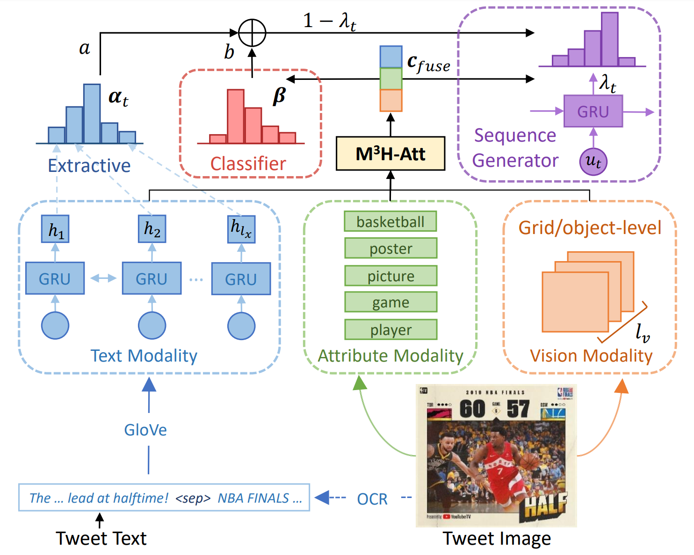
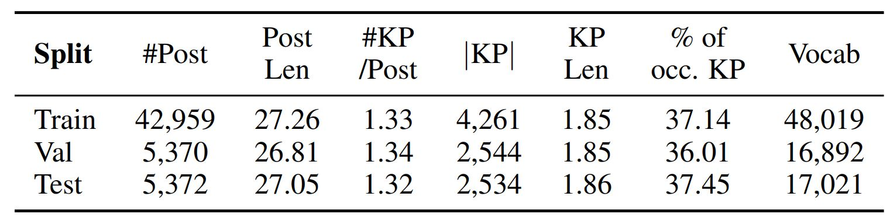

# CMKP
PyTorch Code for the following paper at EMNLP2020:\
**Title**: Cross-Media Keyphrase Prediction: A Unified Framework with Multi-Modality Multi-Head Attention and Image Wordings \[[pdf](https://arxiv.org/pdf/2011.01565.pdf)\] \
**Authors**: Yue Wang, Jing Li, Michael Lyu, and Irwin King \
**Institute**: CUHK and PolyU \
**Abstract** \
Social media produces large amounts of contents every day. To help users quickly capture what they need, keyphrase prediction is receiving a growing attention. Nevertheless, most prior efforts focus on text modeling, largely ignoring the rich features embedded in the matching images. In this work, we explore the joint effects of texts and images in predicting the keyphrases for a multimedia post. To better align social media style texts and images, we propose: (1) a novel Multi-Modality Multi-Head Attention (M3H-Att) to capture the intricate cross-media interactions; (2) image wordings, in forms of optical characters and image attributes, to bridge the two modalities. Moreover, we design a unified framework to leverage the outputs of keyphrase classification and generation and couple their advantages. Extensive experiments on a large-scale dataset newly collected from Twitter show that our model significantly outperforms the previous state of the art based on traditional attention networks. Further analyses show that our multi-head attention is able to attend information from various aspects and boost classification or generation in diverse scenarios.

**Framework illustration**\


## Code structure
```
CMKP/
├── README.md
├── LICENSE
├── CMKP.PNG
├── data
│   ├── tw_mm_s1
│   ├── tw_mm_s1_ocr
│   └── tw_mm_s1_tiny
├── processed_data
│   ├── tw_mm_s1
│   ├── tw_mm_s1_ocr
│   └── tw_mm_s1_tiny
├── sh
│   ├── models
│   ├── sample_model
│   ├── pred
│   ├── sample_pred
│   ├── results
│   ├── run_exp.py
│   └── sample_pred
└── unified_model
    ├── multi_head_att
    ├── metric_utils.py
    ├── model.py
    ├── modules.py
    ├── my_io.py
    ├── pred_evaluate_func.py
    ├── predict.py
    ├── prepare_tw_glove_emb.py
    ├── preprocess.py
    ├── run_batches.py
    ├── sequence_generator.py
    ├── train.py

```
We store the running scripts in `sh/run_exp.py`, it will save the models in `sh/models` and predictions in `sh/pred`, and summarize the results into `sh/results`.\
We provide a simpler model without using image attribute in `sh/sample_model/joint_unified_model.ckpt` (downloaded from [here](https://drive.google.com/file/d/1noVIsPkMp8lH_b86nW4oKpVjFJCHl1FV/view?usp=sharing))  that achieves a F1 score of **47.13**, which is comparable to the best results in our paper. Its prediction is saved in `sh/sample_pred/best_pred.txt`.


**TODO** For the full model described in the paper, it will be released soon.


## Installation
```
# Create environment
conda create -n CMKP  python==3.6

# Install pytorch 
conda install -n CMKP  -c pytorch pytorch==1.2 torchvision

# Other packages
pip install nltk h5py
```

## Data
We crawl **53,701** image-text tweets with user-annotated hashtags from Twitter from January to June 2019.\
For raw tweet image data, please find it from [here](https://drive.google.com/file/d/1WsDldDXsnkzT7qfTsu2pW4PMeg6zZhN_/view?usp=sharing).
The tweet text data is stored in `data`, where we provide three variants: without OCR, with OCR appended at the end of post, a tiny data (50 instances) for fast running the code.
For the `tw_mm_s1_ocr` with VGG and attribute features, please download it from [here](https://drive.google.com/file/d/1RETR9rljL2vLZa3EVKFWeOEOmuF0VVC7/view?usp=sharing) and unzip into `data/tw_mm_s1_ocr`.



## Prepare image and text features
Please find it from `ext_feats`, where we provide codes to extract VGG or BUTD visual features (`infer_visual_feat`), image attribute features (`infer_attribute`), and OCR texts (`infer_OCR`) from the image, and extract Glove embedding (`prepare_tw_glove_emb.py`) and BERT features (`infer_bert`) from the text.

**Note**: please find the attribute predictor pretrained on MS COCO caption dataset from [here](https://drive.google.com/file/d/1MLJgFlXVD80VMAcrtINEPva1qHIiR2-n/view?usp=sharing). 
  

## How to run our model?

### Preprocessing
Before training, you need to run `python preprocess.py` to preprocess the raw text data. You can revise the data_tag (e.g., tw_mm_s1, tw_mm_s1_ocr, tw_mm_s1_tiny) at Line 166 of `preprocess.py`.
It will transform the raw texts into token ids and embeddings into `processed_data`.
```
python /research/lyu1/yuewang/workspace/CMKP/unified_model/preprocess.py
Finish reading 42959 lines of data from ../data/tw_mm_s1_ocr/train_src.txt
Building vocabulary from training data
Filtered vocab size: 45000 / 48020
Building target class vocab: 4262
Src+trg word vocab_size: 45006, trg class vocab_size: 4262
Finish reading 5370 lines of data from ../data/tw_mm_s1_ocr/valid_src.txt
Finish reading 5372 lines of data from ../data/tw_mm_s1_ocr/test_src.txt
#pairs of train data  = 57126
#pairs of valid data  = 7185
#pairs of test data  = 5372

Finish and take 15.56 seconds

Running command: python prepare_tw_glove_emb.py -data_tag tw_mm_s1_ocr
Start loading embedding for vocab: ../processed_data/tw_mm_s1_ocr/vocab.pt
Find 36940/45006 from glove embedding, takes 36.97 seconds
Saving embedding into ../processed_data/tw_mm_s1_ocr/glove_emb.pkl
```

### Training, predicting, and evaluating
We first joint train the unified model without aggregating the classification outputs for generation for 10 epochs. It aims to warm up the classifier to make sure that it can predict reliable outputs.
```
python ../unified_model/train.py -cur_model mixture_img_text_multi_head_att_h4_d128 -data_tag tw_mm_s1_ocr -seed 23  -res_fn results/mixture_multi_head_ocr_pretrain.csv

# seq2seq or classifer predictions at various epochs, F1 score
# e3_TL18.72_VL5.42_0h-05m_seq2seq.txt,0.41368
# e3_TL18.72_VL5.42_0h-05m_classifier.txt,0.38598
# e4_TL21.81_VL5.52_0h-08m_seq2seq.txt,0.43042
# e4_TL21.81_VL5.52_0h-08m_classifier.txt,0.40529
# e5_TL23.80_VL5.30_0h-11m_seq2seq.txt,0.44459
# e5_TL23.80_VL5.30_0h-11m_classifier.txt,0.42924
# e6_TL25.46_VL5.45_0h-15m_seq2seq.txt,0.44050
# e6_TL25.46_VL5.45_0h-15m_classifier.txt,0.42305
# e7_TL26.71_VL5.43_0h-18m_seq2seq.txt,0.44807
# e7_TL26.71_VL5.43_0h-18m_classifier.txt,0.43612
# e8_TL27.70_VL5.46_0h-22m_seq2seq.txt,0.45720
# e8_TL27.70_VL5.46_0h-22m_classifier.txt,0.44287
# e9_TL28.58_VL5.48_0h-25m_seq2seq.txt,0.45385
# e9_TL28.58_VL5.48_0h-25m_classifier.txt,0.44066
# e10_TL29.39_VL5.51_0h-29m_seq2seq.txt,0.45478
# e10_TL29.39_VL5.51_0h-29m_classifier.txt,0.44210
```

Then, we further fine-tune the unified model with aggregating the classification outputs for keyphrase generation. Note that we fix the classifier and only optimize the keyphrase generator.
```
============================Start Running (0)==========================
python ../unified_model/train.py -cur_model mixture_img_text_multi_head_att_h4_d128_combine_direct  -model_path ../../MMKG/joint_train/models/mixture_img_text_multi_head_att_h4_d128-copy_vgg_glove_s24_0527-1649_26.500M-tw_mm_s1_ocr/e10_TL30.15_VL5.52_0h-31m.ckpt -data_tag tw_mm_s1_ocr -seed 24 -fix_classifier 1 -res_fn results/mixture_multi_head_ocr_combine_direct_seed.csv

Namespace(batch_size=64, bidirectional=True, continue_to_predict=True, copy_attn=1, cur_model='mixture_img_text_multi_head_att_h4_d128_combine_direct', data_path='../processed_data/tw_mm_s1_ocr/', data_tag='tw_mm_s1_ocr', debug=0, device=device(type='cuda'), dropout=0.1, early_stop_tolerance=5, emb_path='../processed_data/tw_mm_s1_ocr/glove_emb.pkl', emb_size=200, emb_type='glove', epochs_to_save=3, fix_classifier=1, head_diff_weight=None, hidden_size=150, img_ext_model='vgg', is_test=False, learning_rate=0.001, learning_rate_decay=0.5, log_step=100, max_grad_norm=5, model_dir='models/mixture_img_text_multi_head_att_h4_d128_combine_direct-copy_vgg_glove_s24_1124-1051', model_path='../../MMKG/joint_train/models/mixture_img_text_multi_head_att_h4_d128-copy_vgg_glove_s24_0527-1649_26.500M-tw_mm_s1_ocr/e10_TL30.15_VL5.52_0h-31m.ckpt', model_tag='copy_vgg_glove_s24_1124-1051', num_epochs=15, num_layers=2, raw_data_path='../data/tw_mm_s1_ocr', res_fn='results/mixture_multi_head_ocr_combine_direct_seed.csv', seed=24, use_attr=False, use_bert_src=False, use_img=True, use_ocr=False, use_text=True)

Load vocab from ../processed_data/tw_mm_s1_ocr/vocab.pt: token vocab size: 45006, trg label vocab size: 4262

=====================================================================
For Combine mode: fix the classifier [1], set learning rate into 0.00010, save model after epoch 1
=====================================================================

Load 57126 instances from ../processed_data/tw_mm_s1_ocr/train.pt
Load 7185 instances from ../processed_data/tw_mm_s1_ocr/valid.pt
Finish preparing data load for train (893 batches) and valid (113 batches) with batch size: 64

Load glove embedding!

Stacked 1 multi-head attention layer with head num: 4, dim: 128
The weights are shared by both encoder and decoder!


=============================Fix the classifier===========================
Finish building model with 14541408 parameters (14.541M)

The trained models after 1 epochs will be saved into models/mixture_img_text_multi_head_att_h4_d128_combine_direct-copy_vgg_glove_s24_1124-1051_14.541M-tw_mm_s1_ocr
Load saved model from ../../MMKG/joint_train/models/mixture_img_text_multi_head_att_h4_d128-copy_vgg_glove_s24_0527-1649_26.500M-tw_mm_s1_ocr/e10_TL30.15_VL5.52_0h-31m.ckpt and continue to train from 0

==============================Training=================================
Entering the training and validating for 5 epochs

Begin training for epoch 1
Epoch [1/5], Step [89/893], Loss: 0.680749, Seq2seq: 0.072127, Classifier: 0.608623, Time: 9.53
Epoch [1/5], Step [178/893], Loss: 0.591458, Seq2seq: 0.107286, Classifier: 0.484173, Time: 18.28
Epoch [1/5], Step [267/893], Loss: 0.764482, Seq2seq: 0.168933, Classifier: 0.595549, Time: 27.30
Epoch [1/5], Step [356/893], Loss: 0.857880, Seq2seq: 0.182177, Classifier: 0.675703, Time: 36.29
Epoch [1/5], Step [445/893], Loss: 0.594642, Seq2seq: 0.109923, Classifier: 0.484720, Time: 45.42
Epoch [1/5], Step [534/893], Loss: 0.602855, Seq2seq: 0.082068, Classifier: 0.520787, Time: 54.40
Epoch [1/5], Step [623/893], Loss: 0.578858, Seq2seq: 0.058466, Classifier: 0.520392, Time: 63.35
Epoch [1/5], Step [712/893], Loss: 0.543625, Seq2seq: 0.052199, Classifier: 0.491426, Time: 72.78
Epoch [1/5], Step [801/893], Loss: 0.417315, Seq2seq: 0.039078, Classifier: 0.378237, Time: 82.23
Epoch [1/5], Step [890/893], Loss: 0.480464, Seq2seq: 0.053576, Classifier: 0.426889, Time: 91.73
Train Epoch 1, Avg Loss: 0.6477, Seq2seq: 0.1160, Classifier: 0.5317, Time: 92.05

Valid Epoch 1, Avg Loss: 5.4474, Seq2seq: 1.5515, Classifier: 3.8958, Time: 101.00

Saving checkpoint into models/mixture_img_text_multi_head_att_h4_d128_combine_direct-copy_vgg_glove_s24_1124-1051_14.541M-tw_mm_s1_ocr/e1_TL0.65_VL5.45_0h-01m.ckpt

==================================Predict Seq2seq===================================

Load vocab from ../processed_data/tw_mm_s1_ocr/vocab.pt: token vocab size: 45006, trg label vocab size: 4262
Load 5372 instances from ../processed_data/tw_mm_s1_ocr/test.pt
Receiving 84 batches with batch_size=64
Batch [1/84], Time: 1.37
Batch [17/84], Time: 16.61
Batch [33/84], Time: 32.94
Batch [49/84], Time: 49.10
Batch [65/84], Time: 65.17
Batch [81/84], Time: 82.76

Finish writing 5372 lines to pred/mixture_img_text_multi_head_att_h4_d128_combine_direct-copy_vgg_glove_s24_1124-1051_14.541M-tw_mm_s1_ocr_e1_TL0.65_VL5.45_0h-01m_seq2seq.txt, takes 85.83

================================Begin evaluate=================================
Command: python ../pred_evaluate_func.py -pred pred/mixture_img_text_multi_head_att_h4_d128_combine_direct-copy_vgg_glove_s24_1124-1051_14.541M-tw_mm_s1_ocr_e1_TL0.65_VL5.45_0h-01m_seq2seq.txt -src ../data/tw_mm_s1_ocr/test_src.txt -res_fn results/mixture_multi_head_ocr_combine_direct_seed.csv

/research/lyu1/yuewang/workspace/CMKP/unified_model/metric_utils.py:416: RuntimeWarning: invalid value encountered in true_divide
  ndcg_array = dcg_array / dcg_max_array
/research/lyu1/yuewang/workspace/CMKP/unified_model/metric_utils.py:535: RuntimeWarning: invalid value encountered in true_divide
  alpha_ndcg_array = alpha_dcg_array / alpha_dcg_max_array
Processing 1000 lines and takes 1.63
Processing 2000 lines and takes 3.22
Processing 3000 lines and takes 4.79
Processing 4000 lines and takes 6.37
Processing 5000 lines and takes 7.96

Finish evaluating for 5372/5372 instances

macro_avg_f1@1_all,macro_avg_f1@3_all,MAP@5_all,avg_NDCG@5_all
All: 0.47130,0.33224,0.52261,0.58257
Present: 0.82502,0.79918
Absent: 0.28103,0.22401
================================Finish evaluate=================================

=================>Seq2seq F1@1: 0.47130

Valid loss drops

Begin training for epoch 2
...
```

We provide our pretrained models in [here](https://drive.google.com/file/d/1noVIsPkMp8lH_b86nW4oKpVjFJCHl1FV/view?usp=sharing) for replicating the above results.

# Citation
If you find our code and dataset useful in your research, please consider citing our paper:
```
@inproceedings{
    wang2020cmkp,
    title={Cross-Media Keyphrase Prediction: A Unified Framework with Multi-Modality Multi-Head Attention and Image Wordings},
    author={Yue Wang, Jing Li, Michael Lyu, and Irwin King},
    booktitle={Proceedings of the 2020 Conference on Empirical Methods in Natural Language Processing, EMNLP 2020},
    year={2020},
}
```
  
# License
This project is licensed under the terms of the MIT license. 
